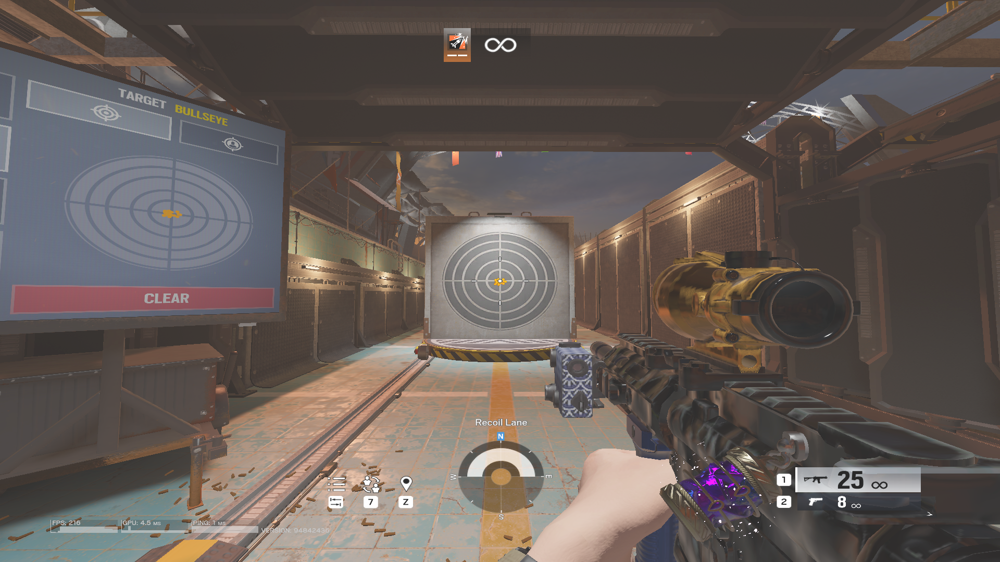

# 🎯 R6 No Recoil



<div align="center">
    <a href="https://github.com/Harry-Hopkinson/R6-No-Recoil/releases/latest">
        
    </a>
    <hr>
    <a href="http://discord.gg/68rUtWqEBy">
        
    </a>
    <a href="https://www.patreon.com/cw/R6NoRecoil">
        
    </a>

| Release Build                                                                                                                                                                                     | Development Build                                                                                                                                                                                      |
| ------------------------------------------------------------------------------------------------------------------------------------------------------------------------------------------------- | ------------------------------------------------------------------------------------------------------------------------------------------------------------------------------------------------------ |
| [](https://github.com/Harry-Hopkinson/R6-No-Recoil/releases/latest/download/R6NoRecoil.zip) | [](https://nightly.link/Harry-Hopkinson/R6-No-Recoil/workflows/CI/main/R6NoRecoil.zip) |

</div>

A lightweight, efficient **no-recoil tool** for Rainbow Six Siege. Designed for smooth performance and ease of use.

## 🧠 Why I Made This

Most recoil tools like Logitech G Hub (now detectable) are bloated, heavy, and come with a ton of unnecessary overhead just to perform a simple task. I built this tool to be **clean**, **compact**, and **laser-focused** on one thing: **removing recoil with minimal system impact**. No drivers, no background bloat—just raw utility.

## 🚀 Why Use This Tool?

- **📌 No Recoil** – Reduces weapon recoil for better accuracy.
- **⚡ Lightweight & Fast** – Optimised for minimal CPU usage.
- **🔧 No Installation Required** – Just run the `.exe`.
- **⚙️ Powerful Config Support** – Modify the Config.toml/WeaponData.json files.
- **🛠️ Highly Customisable** – Save weapon data to presets for quick switching.
- **🖥️ Works on Any Setup** – Supports Windows 10/11.

## 🎮 How to Use

1. **Download** `R6NoRecoil` from the [Github Release Page](https://github.com/Harry-Hopkinson/R6-No-Recoil/releases/latest).
2. **Run the Program** (double-click `R6NoRecoil.exe`).
3. **Choose whether attacking or defending**.
4. **Choose your operator and their primary weapon**.
5. **Choose your weapon preset**.
6. **Controls:**
    - **Press `Toggle Recoil`** → Toggle the no-recoil effect on/off.
    - **Press `Change Mode`** → Adjust the strength of the recoil compensation.
    - **Press `Toggle Key`** -> Enable/Disable toggle key activating/deactivating recoil. Default CapsLock.
    - **Press `Save Config`** -> Save current weapon data to the selected preset.
    - **Switch to Defenders/Attackers** -> Change operator type.
7. **Enjoy Smoother Aim!**

## 💸 Support Development

Any form of donation is greatly appreciated and will help keep me motivated to keep working on this project and developing it further with new features and improvements. If you become a member you get:

- Early access to new releases.
- Requests for custom builds of the program.
- Custom discord roles.
- Help support me develop bigger and better features for this project.

[](https://www.patreon.com/cw/R6NoRecoil)

## ⚙️ Config Explained

The app automatically creates a `Config.toml` file on first run. You can manually edit it to customise the experience.

### Example:

```toml
[RecoilPresets]
Enabled = true
VerticalRecoil = 3
HorizontalRecoil = 0

[Controller]
Enabled = false
Multiplier = 10

[ToggleKey]
# Use https://learn.microsoft.com/en-us/windows/win32/inputdev/virtual-key-codes
# And then convert the key code to decimal
# Toggle Key (e.g. 20 = CAPS LOCK)
ToggleKey = 20
Enabled = false
```

### Fields Explained

#### [RecoilPresets]

- **Enabled:** Enable or disable recoil adjustment.
- **VerticalRecoil:** The vertical recoil compensation value.
- **HorizontalRecoil:** The horizontal recoil compensation value (Positive goes right, negative goes left)

#### [Controller]

- **Enabled:** Enable or disable recoil adjustment with a controller.
- **Multiplier:** The multiplier for controller adjustment when firing.

#### [ToggleKey]

- **ToggleKey:** The key code for toggling recoil adjustment.
- **Enabled:** Enable or disable recoil adjustment with a toggle key.

## 🔫 WeaponData.json Explained

The app uses a `WeaponData.json` file to store **recoil compensation values** for each weapon. This allows you to fine-tune how much recoil reduction is applied for every primary gun in Rainbow Six Siege.

### Example Structure

```json
{
    "name": "R4-C",
    "preset-1": { "vertical": 7.5, "horizontal": 0 },
    "preset-2": { "vertical": 3.0, "horizontal": 0 },
    "preset-3": { "vertical": 0.0, "horizontal": 0 }
},
```

### Fields Explained

- **name:** The exact name of the weapon as recognised by the app.
- **preset-1/2/3** Specifies which preset to use for the weapon.
- **vertical:** The amount of vertical recoil compensation applied.
    - **Higher values (Vertical) = stronger recoil reduction**
    - **Lower values (Vertical) = lighter recoil reduction**
- **horizontal:** The amount of horizontal recoil compensation applied.
    - **Positive Values (Horizontal) = movement to the right**
    - **Negative Values (Horizontal) = movement to the left**

## ⚠️ Disclaimer

This tool is for **educational purposes only**. Use it at your own risk. I do not advocate cheating.
Windows Defender may falsely flag this program as a virus. Just allow the app to run anyway. If you are unsure, use **VirusTotal** to check the program.

---

**Got questions?** Feel free to open an issue!
