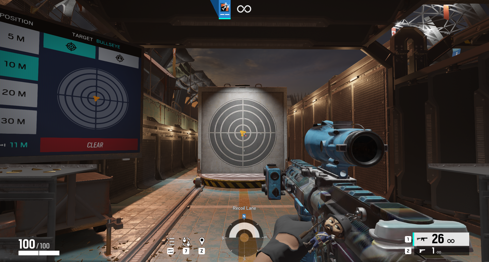

# 🎯 R6 No Recoil



<div align="center">
    <a href="https://github.com/Harry-Hopkinson/R6-No-Recoil/releases/latest">
        
    </a>
</div>

A lightweight, efficient **no-recoil tool** for Rainbow Six Siege. Designed for smooth performance and ease of use.

## 🧠 Why I Made This

Most recoil tools like Logitech G Hub are bloated, heavy, and come with a ton of unnecessary overhead just to perform a simple task. I built this tool to be **clean**, **compact**, and **laser-focused** on one thing: **removing recoil with minimal system impact**. No drivers, no background bloat—just raw utility.

## 🚀 Why Use This Tool?

- **📌 No Recoil** – Reduces weapon recoil for better accuracy.
- **⚡ Lightweight & Fast** – Optimised for minimal CPU usage.
- **🔧 No Installation Required** – Just run the `.exe`.
- **⚙️ Powerful Config Support** – Modify the Config.toml file.
- **🖥️ Works on Any Setup** – Supports Windows 10/11.
- **🛠️ Open Source & Customisable** – Modify as needed.

## 🎮 How to Use

1. **Download** `r6-no-recoil.exe` from the [Github Release Page](https://github.com/Harry-Hopkinson/R6-No-Recoil/releases/latest).
2. **Run the Program** (double-click `r6-no-recoil.exe`).
3. **Controls:**
   - **Press `Toggle Recoil`** → Toggle the no-recoil effect on/off.
   - **Press `Change Mode`** → Adjust the strength of the recoil compensation.
4. **Enjoy Smoother Aim!**

## ⚠️ Important Setup Note

To ensure the recoil compensation behaves consistently across all systems, you must disable Windows mouse acceleration:
🔧 How to disable **Enhance Pointer Precision**

1. **Open the Control Panel.**
2. **Go to Mouse → Pointer Options.**
3. **Uncheck the box for "Enhance pointer precision".**
4. **Click Apply and OK.**

This prevents Windows from altering mouse movement and ensures the tool moves your mouse by exact values for pixel-perfect recoil control.

## ⚙️ Config Explained

The app automatically creates a `Config.toml` file on first run. You can manually edit it to customise the experience.

### Example:

```toml
[RecoilPresets]
# 0 = LOW, 1 = MEDIUM, 2 = HIGH, 3 = ULTRA
Mode = 1
Enabled = true

# Vertical recoil amounts for each preset
LowSensVertical = 2
MediumSensVertical = 3
HighSensVertical = 4
UltraSensVertical = 5

# Horizontal recoil amounts for each preset
LowSensHorizontal = 0
MediumSensHorizontal = 0
HighSensHorizontal = 0
UltraSensHorizontal = 0

# Toggle Key (e.g. 20 = CAPS LOCK)
ToggleKey = 20
```

## 🚧 Currently in Development

- **Improved GUI** – A cleaner, more user-friendly interface is being developed with Operator Images.
- **Customisation Options** – Ability to fine-tune settings via a UI panel.

## ⚠️ Disclaimer

This tool is for **educational purposes only**. Use it at your own risk. I do not advocate cheating.
Windows Defender may falsely flag this program as a virus. Just allow the app to run anyway. If you are unsure, use **VirusTotal** to check the program.

---

**Got questions?** Feel free to open an issue!
